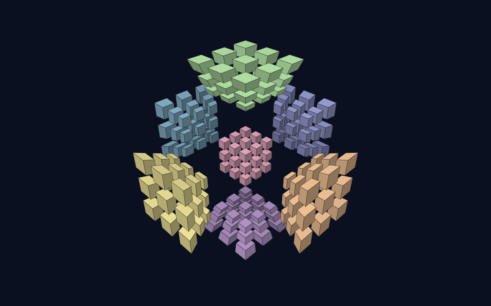

# Tesseract — a 4D Rubik's Cube

A minimalist, dark-mode puzzle: solve a **genuinely 4-dimensional** Rubik's cube
(the 3⁴ hypercube) inside a 3D environment. Pure HTML/CSS/JavaScript on a single
`<canvas>` — **no build step, no dependencies**.

**▶ Play it live: https://janpieterbaalder.github.io/tesseract-4d-rubiks-cube/**



## Run it

Just open `index.html` in any modern browser (Chrome, Edge, Firefox).

That's it — double-click the file. If your browser restricts `file://` for some
reason, serve the folder instead:

```bash
python -m http.server 8000
# then open http://localhost:8000
```

## What makes it actually 4D

A 3D Rubik's cube has **6 flat faces**. Its 4D analogue, the *tesseract*, has
**8 cubic cells**. The puzzle is drawn with the classic 4D perspective
projection: a small cube nested inside a large one, with the six cells between
them shown as tapering "tunnels". The colours you see are real — every one of
the 8 cells is a distinct shade.

- **80 movable pieces** (3⁴ − 1), each carrying one sticker per axis it touches.
- A **twist** turns one cell — all 27 pieces in that slab — by 90° in one of the
  **three** planes perpendicular to the cell's axis. (A 3D cube has only *one*
  such plane per face; the extra planes are what makes this 4-dimensional.)
- Every scramble is generated from the same moves you can make, so it is
  **always solvable**. Solving uses the *visual* criterion (as in MagicCube4D):
  every cell must be a single colour — hidden orientations of pieces whose
  stickers carry no visible information are not required.
- The 8 cells use a **colour-blind-friendly palette** (based on Okabe-Ito): the
  hues avoid the red/green confusion axes and every colour sits on its own
  lightness level, with opposite cells maximally different, so every cell stays
  recognisable at a glance — also with a colour-vision deficiency.
- The in-cell geometry is **uniform**: every cell spreads its 27 blocks
  identically, and all visible differences between cells (the small nested
  centre cube, the tapering tunnels) come purely from the genuine 4D
  perspective projection. Rotate any cell into the centre and it looks exactly
  like the cell that was there before — no per-cell distortion.

## Verified mathematics

`test/math.test.js` loads the real engine and proves the puzzle model is sound
(run with `npm i jsdom && node test/math.test.js`):

- piece census matches the true 3⁴ structure: 8 one-colour, 24 two-colour,
  32 three-colour and 16 four-colour pieces (80 movable, 216 stickers);
- every twist matrix is a signed permutation with determinant +1 — a genuine
  orientation-preserving rotation, never a reflection;
- generator orders are exact (90° twist⁴ = 180° grip² = 120° grip³ = identity);
- the three 90° plane twists of a cell generate exactly its 24-element rotation
  group, and every edge/corner grip is a member — all grips are legal moves;
- twists permute the 80 pieces bijectively, preserve piece type, keep the
  twisted slab in its cell and never touch outside pieces;
- position and orientation stay consistent (`cur == rot · solved`) through long
  random mixed-twist sequences, and a 300-move scramble replayed in reverse
  returns every piece exactly home.

The geometry pipeline is: sticker cube (in 4D) → rotate in 4D (view + twist
animation) → perspective-project **4D → 3D** → orbit → perspective-project
**3D → 2D** → depth-sorted, light-shaded quads.

## Learn to solve — the Hypercube Academy

New here? Hit the **Learn** button (or press `L`) and meet **Professor Tess**,
your personal teacher: **23 guided lessons in 7 chapters** that run inside the
live 3D scene and take you from zero to a complete solving method. The
professor (an avatar with speech bubbles and moods) doesn't just describe the
puzzle — she **teaches** it:

- she **demonstrates moves on the cube itself**, with animated demos you can
  skip or replay;
- she **lights up the blocks that matter** — the cell she's talking about, the
  piece that's out of place, the plus you're building — with a pulsing golden
  glow and a spotlight that dims everything else;
- she **hands you the controls** after every demonstration: free-practice
  objectives detected through the actual engine (twists, grips, undos, piece
  selections, 4D view moves and solved-state checks);
- she **guides specific algorithms move by move**: each expected move is
  spelled out, the right twist button pulses once you select the right cell,
  and a wrong move is gently taken back;
- lessons run on a **practice copy** of the puzzle — your own game (state,
  history, camera, clock) is parked on entry and restored the moment you
  leave.

All lessons are open from the start — browse the map and dip in anywhere;
finished lessons are ticked off and progress is saved in the browser. All
lesson texts adapt to touch devices (no Ctrl/Shift talk on a phone).

| Chapter | What you learn |
| --- | --- |
| 1 · Welcome to the 4th Dimension | Read the projection, orbit/zoom, centre cells, rotate through 4D, find the hidden cell |
| 2 · How the Cube Moves | Your first twist (demoed, then yours), all three twist planes guided move-by-move, the 180°/120° grips on glowing blocks, twist order |
| 3 · Detective School | Solve 1-, 2- and 3-twist scrambles with the displaced pieces glowing |
| 4 · Wave 1 · Build the Plus | The four piece families (each lit up in turn), **where to start: the plus** of one cell, a one-move rescue demoed then guided, a two-move rescue algorithm, Wave 1 solo |
| 5 · The Magic Sequence | A B A′ B′ demonstrated, its 13-piece footprint lit up (the provable minimum), the inverse guided move-by-move, your own commutator, conjugates |
| 6 · Waves 2 & 3 · The Endgame | Ferry one glowing piece home with a guided commutator, Wave 2 solo, the famous RKT trick (the centre cell *is* a 3D cube) |
| 7 · Graduation | A fully graded dress rehearsal and a four-twist final exam — with the professor one hint-button away |

The method follows Roice Nelson's
[Ultimate Solution to a 3×3×3×3](https://superliminal.com/cube/solution/solution.htm)
and the modern methods at [hypercubing.xyz](https://hypercubing.xyz/):
two-colour pieces first, then three-colour, then four-colour with the RKT
technique.

## How to play

| Action | Control |
| --- | --- |
| Orbit the view (3D) | Drag |
| Zoom (toward the cursor) | Scroll / pinch |
| Pan the view | Right-drag or `Alt`+drag · two-finger drag (touch) |
| Reset the camera | **View** button in the bottom bar, or `V` |
| Select a cell | Click any sticker — the cell lights up and the twist panel opens |
| Twist the selected cell | The panel's ↺ / ↻ buttons, or keys `1` `2` `3` (`Shift` reverses) |
| Diagonal grips | Select an **edge or corner block** — the panel adds its 180° flip / 120° spin |
| Bring a cell to the centre | Select the cell, then press the panel's **cell → centre** button — or `Ctrl`+click / press-and-hold (touch). A pure view change |
| Rotate through the 4th dimension | `Shift`+drag |
| Scramble · Undo · Reset | `S` · `U` · `R` |
| Open the Academy (lessons) | **Learn** button, or `L` / `T` — during a lesson, `R` restarts it, `Enter` continues |
| Minimise the lesson panel | `–` button on the panel, or `M` — the lesson keeps running, only the current objective or guided move stays visible; tap the bar to expand |

**Tip:** because cells hide behind one another, ctrl-click (or hold) a cell to
centre it before working on it — centring also cycles the hidden cell back
into view.

## Files

| File | Purpose |
| --- | --- |
| `index.html` | Markup + HUD panels + Academy lesson panel & lesson map |
| `styles.css` | Dark, glassy theme around the bright puzzle palette |
| `app.js` | 4D model, twist engine, projection, renderer, input, Hypercube Academy tutor (Professor Tess) |
| `test/math.test.js` | Mathematical verification of the puzzle engine |
| `test/levels.test.js` | Behaviour tests for the Academy tutor: curriculum shape, step flow, the practice-copy snapshot, a full playthrough of every lesson, guided-move matching, wave goals |

## Tweaking

All visual/geometry constants live at the top of `app.js`:

- `COLORS` — the 8 colour-blind-friendly cell colours
- `CELL_SPREAD` — how far apart the 27 blocks inside each cell sit (uniform for all cells)
- `STICKER_HALF` — sticker size (`CELL_SPREAD − 2·STICKER_HALF` = see-through gap)
- `V4D` / `V3D` — 4D and 3D camera distances (inner-vs-outer cell ratio and tunnel
  taper come entirely from the 4D perspective, so `V4D` is the one knob for the
  nested look)

## Sources for the solving method

- The Ultimate Solution to a 3×3×3×3 (Roice Nelson): https://superliminal.com/cube/solution/solution.htm
- MagicCube4D: https://superliminal.com/cube/
- Hypercubing wiki (piece counts, methods, RKT): https://hypercubing.xyz/
- RKT technique: https://hypercubing.xyz/techniques/rkt/
